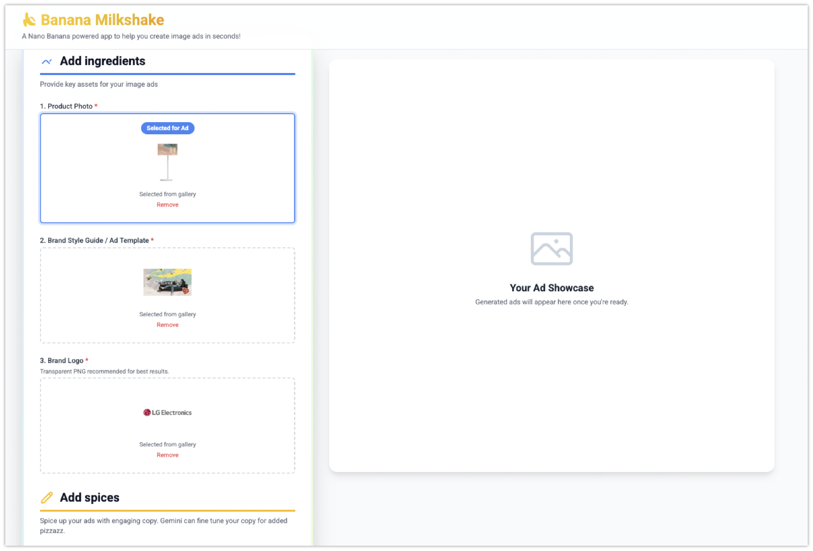
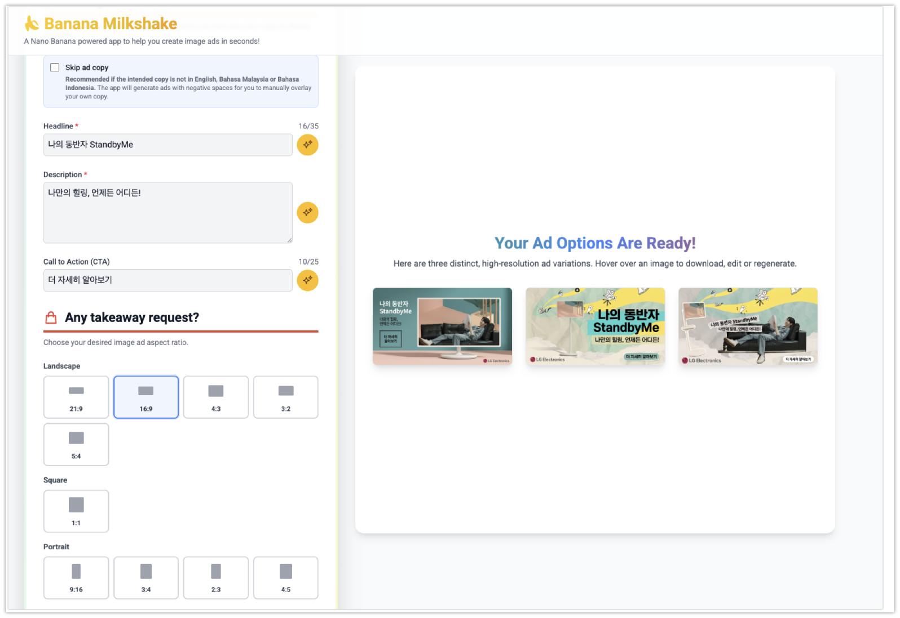

## Architecture Overview

This project is built using:
- **Frontend**: React + Vite (TypeScript) located in the `/frontend` directory
- **Backend**: Python + FastAPI located in the `/backend` directory
- **Deployment**: Both tiers are packaged into a single Docker container. The FastAPI backend serves the built React app as static files.




## Run Locally (Development mode)

**Prerequisites:** Node.js (for frontend) and Python 3.11+ (for backend).

1. **Configure Environment Variables**:
   Create a file named `.env` in the root folder of the project and add your Google Gemini API key:
   ```env
   GEMINI_API_KEY="your_api_key_here"
   ```

2. **Start the Python Backend**:
   ```bash
   cd backend
   pip install -r requirements.txt
   uvicorn main:app --reload
   ```
   *(The backend runs on http://localhost:8000)*

3. **Start the React Frontend**:
   ```bash
   cd frontend
   npm install
   npm run dev
   ```
   *(Vite dev server runs on http://localhost:3000 and proxies `/api` requests to the backend)*

## Deploy to Google Cloud Run

This project is optimized for a simple, single-command deployment to Google Cloud Run using the `gcloud` CLI. The provided multi-stage `Dockerfile` handles building both the Node.js frontend and the Python backend into one cohesive image.

1. **Prerequisites**: Ensure you have authenticated to Google Cloud (`gcloud auth login`) and selected your project.
2. **Deploy**:
   Execute the following command from the root directory of the project:

   ```bash
   gcloud run deploy banana-milkshake-url \
       --source . \
       --region us-central1 \
       --allow-unauthenticated \
       --set-env-vars GEMINI_API_KEY="your-gemini-api-key"
   ```

   *Note: Modify the `--region` if you prefer to deploy to another location (e.g., `asia-northeast3` for Seoul).*

3. Once finished, the terminal will provide you with a live `https://...run.app` URL where your application is securely hosted!
